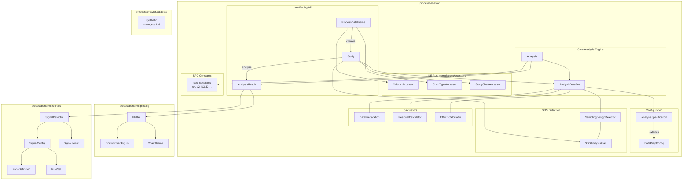

# ProcessBehavior Architecture

This document describes the module and class hierarchy of the processbehavior package.

## Module Diagram



## Class Hierarchy Summary

| Module | Classes | Purpose |
|--------|---------|---------|
| **User API** | `ProcessDataFrame`, `Study`, `AnalysisResult` | Main entry points for users |
| **Core** | `Analysis`, `AnalysisDataSet` | Chart calculations and data management |
| **Config** | `DataPrepConfig`, `AnalysisSpecification` | Specification objects (inheritance) |
| **Detection** | `SamplingDesignDetector`, `SDSAnalysisPlan` | Auto-detect data structure |
| **Calculators** | `DataPreparation`, `ResidualCalculator`, `EffectsCalculator` | Data transforms and VAS |
| **plotting** | `Plotter`, `ControlChartFigure`, `ChartTheme` | Plotly-based visualization |
| **signals** | `SignalDetector`, `SignalConfig`, `SignalResult`, `ZoneDefinition`, `RuleSet` | WECO rules detection |
| **datasets** | `synthetic` module | Test data generators |

## Typical User Workflow

```
ProcessDataFrame --> formulate() --> Study --> analyze() --> AnalysisResult
                                                                   |
                                                                   v
                                                 plot() / detect_signals() / to_excel()
```

## Module Descriptions

### User-Facing API

- **ProcessDataFrame**: Main entry point. Wraps a pandas DataFrame and provides IDE auto-completion for column names via `ColumnAccessor`.
- **Study**: Formulation layer created by `ProcessDataFrame.formulate()`. Contains SDS detection results, valid charts, and the `analyze()` method.
- **AnalysisResult**: Unified result container returned by `Study.analyze()`. Provides access to charts, plotting, signal detection, and export.

### Core Analysis Engine

- **Analysis**: Core calculation engine that computes control chart statistics (Xbar, S, IMR, R).
- **AnalysisDataSet**: Manages the analysis dataset including VAS residuals (R1-R5, RCR1-RCR5) and effects.

### Configuration

- **DataPrepConfig**: Base configuration for data preparation (response variable, factors, time).
- **AnalysisSpecification**: Extends `DataPrepConfig` with analysis-specific settings (chart type, rounding).

### SDS Detection

- **SamplingDesignDetector**: Detects the Sampling Design State (SDS 0-6) from data structure.
- **SDSAnalysisPlan**: Contains valid charts, recommended chart, and residual chart options for a detected SDS.

### Calculators

- **DataPreparation**: Validates and prepares data (type conversion, sorting, RSG creation).
- **ResidualCalculator**: Computes VAS residuals (R1-R5) for variance decomposition.
- **EffectsCalculator**: Computes main effects and interactions from the data.

### plotting Subpackage

- **Plotter**: Creates Plotly control chart visualizations with faceting support.
- **ControlChartFigure**: Wrapper around Plotly Figure with convenience methods.
- **ChartTheme**: Dataclass defining chart appearance (colors, fonts, markers).

### signals Subpackage

- **SignalDetector**: Applies WECO rules to detect out-of-control signals.
- **SignalConfig**: Configuration for which rules to apply and zone definitions.
- **SignalResult**: Container for detected signals with summary statistics.
- **ZoneDefinition**: Defines zones A, B, C for run rules.
- **RuleSet**: Predefined rule sets (WECO, Nelson, etc.).

### datasets Subpackage

- **synthetic**: Functions to generate synthetic data for each SDS type (`make_sds1` through `make_sds6`).

## File Structure

```
processbehavior/
├── __init__.py              # Package exports
├── process_dataframe.py     # ProcessDataFrame, ColumnAccessor, ChartTypeAccessor
├── study.py                 # Study, StudyChartAccessor
├── analysis.py              # Analysis
├── analysis_dataset.py      # AnalysisDataSet
├── analysis_result.py       # AnalysisResult
├── analysis_specification.py # DataPrepConfig, AnalysisSpecification
├── sds_detector.py          # SamplingDesignDetector, SDSAnalysisPlan
├── data_preparation.py      # DataPreparation
├── residual_calculator.py   # ResidualCalculator
├── effects_calculator.py    # EffectsCalculator
├── spc_constants.py         # c4, d2, D3, D4, calculate_limits, etc.
├── plotting/
│   ├── __init__.py
│   ├── plotter.py           # Plotter
│   ├── control_chart.py     # ControlChartFigure
│   └── themes.py            # ChartTheme
├── signals/
│   ├── __init__.py
│   ├── detector.py          # SignalDetector
│   ├── detectors.py         # Rule detection functions
│   ├── config.py            # SignalConfig, ZoneDefinition, RuleSet
│   └── result.py            # SignalResult
└── datasets/
    ├── __init__.py
    └── synthetic.py         # make_sds1..6
```
